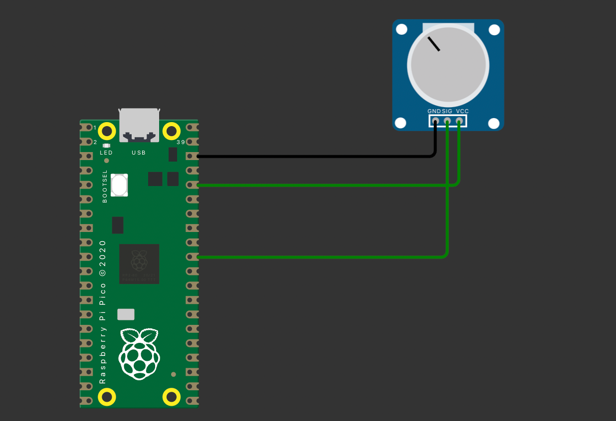
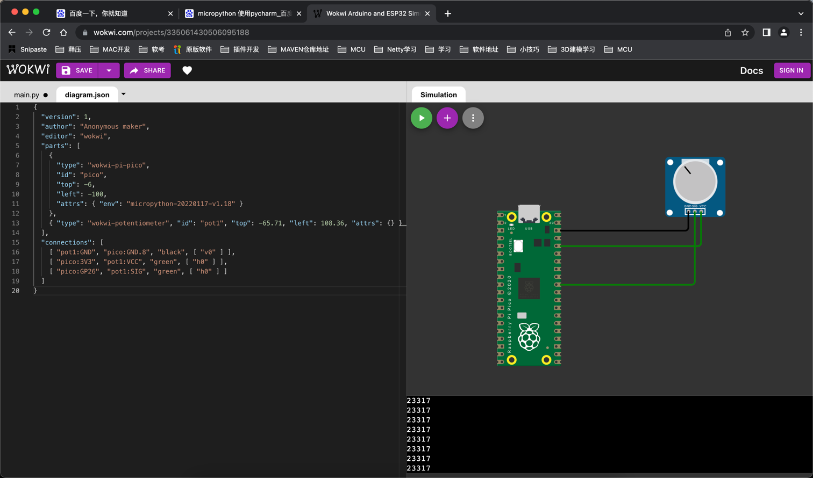

# ADC旋钮读取数据
***

## 1.仿真地址
```angular2html
https://wokwi.com/projects/new/micropython-pi-pico
```
***
# 2.代码
```python
import machine
import utime

potentiometer = machine.ADC(26)
while True:
    utime.sleep(0.5)
    print(potentiometer.read_u16())

```
***
#### 增强版本的中断请求
```python
import machine
import utime

led = machine.Pin(0, machine.Pin.OUT)
btn = machine.Pin(28, machine.Pin.IN)


def btn_irq_handler(pin):
    btn.irq(handler=None)
    timer_reaction = utime.ticks_diff(utime.ticks_ms(), timer_start)
    print("Your reaction time was " + str(timer_reaction) + " milliseconds!")
    led.toggle()
    print(pin)


while True:
    utime.sleep(1)
    timer_start = utime.ticks_ms()
    btn.irq(trigger=machine.Pin.IRQ_RISING, handler=btn_irq_handler)

```
***
## 3.实际电路图


***
## 4.电路图json diagram.json
```json
{
  "version": 1,
  "author": "Anonymous maker",
  "editor": "wokwi",
  "parts": [
    {
      "type": "wokwi-pi-pico",
      "id": "pico",
      "top": -6,
      "left": -100,
      "attrs": { "env": "micropython-20220117-v1.18" }
    },
    { "type": "wokwi-potentiometer", "id": "pot1", "top": -65.71, "left": 108.36, "attrs": {} }
  ],
  "connections": [
    [ "pot1:GND", "pico:GND.8", "black", [ "v0" ] ],
    [ "pico:3V3", "pot1:VCC", "green", [ "h0" ] ],
    [ "pico:GP26", "pot1:SIG", "green", [ "h0" ] ]
  ]
}
```
***
## 5.最终结果
