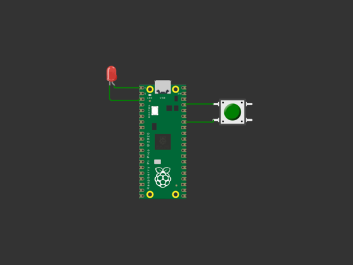
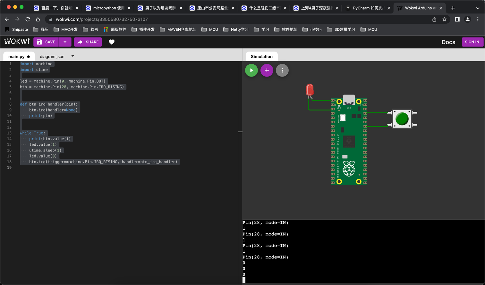

# 中断方式点亮LED
***

## 1.仿真地址
```angular2html
https://wokwi.com/projects/new/micropython-pi-pico
```
***
# 2.代码
```python
import machine
import utime

led = machine.Pin(0, machine.Pin.OUT)
btn = machine.Pin(28, machine.Pin.IN)

def btn_irq_handler(pin):
    btn.irq(handler=None)
    print(pin)

while True:
    print(btn.value())
    led.value(1)
    utime.sleep(1)
    led.value(0)
    btn.irq(trigger=machine.Pin.IRQ_RISING, handler=btn_irq_handler)

```
***
#### 增强版本的中断请求
```python
import machine
import utime

led = machine.Pin(0, machine.Pin.OUT)
btn = machine.Pin(28, machine.Pin.IN)


def btn_irq_handler(pin):
    btn.irq(handler=None)
    if led.value()==1:
        led.value(0)
    else:
        led.value(1)
    print(pin)


while True:
    utime.sleep(1)
    btn.irq(trigger=machine.Pin.IRQ_RISING, handler=btn_irq_handler)

```
***
## 3.实际电路图



***
## 4.电路图json diagram.json
```json
{
  "version": 1,
  "author": "Anonymous maker",
  "editor": "wokwi",
  "parts": [
    {
      "type": "wokwi-pi-pico",
      "id": "pico",
      "top": 6.35,
      "left": -9.6,
      "attrs": { "env": "micropython-20220117-v1.18" }
    },
    {
      "type": "wokwi-led",
      "id": "led1",
      "top": -25.94,
      "left": -75.65,
      "attrs": { "color": "red" }
    },
    {
      "type": "wokwi-pushbutton",
      "id": "btn1",
      "top": 37.38,
      "left": 113.45,
      "attrs": { "color": "green" }
    }
  ],
  "connections": [
    [ "led1:A", "pico:GP0", "green", [ "v0" ] ],
    [ "led1:C", "pico:GND.1", "green", [ "v24.4", "h152" ] ],
    [ "pico:GP28", "btn1:2.l", "gree`n", [ "h0" ] ],
    [ "btn1:1.l", "pico:3V3_EN", "green", [ "h0" ] ]
  ]
}
```
***
## 5.最终结果
